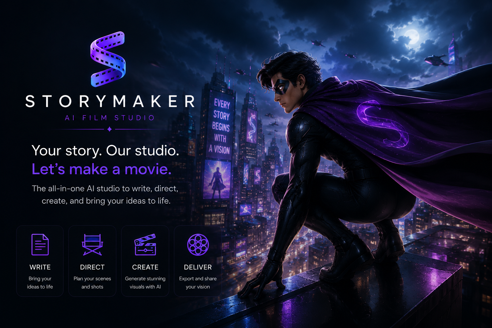
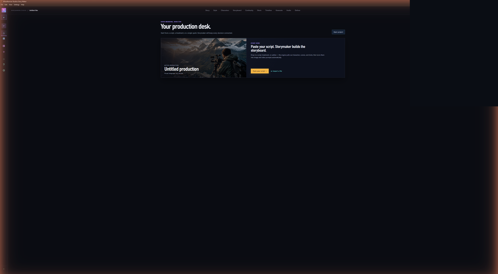
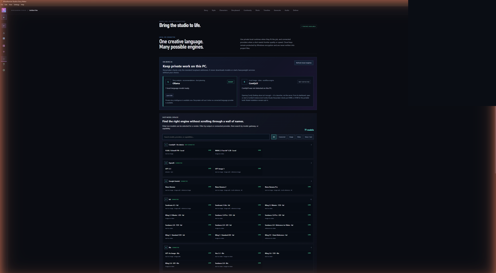
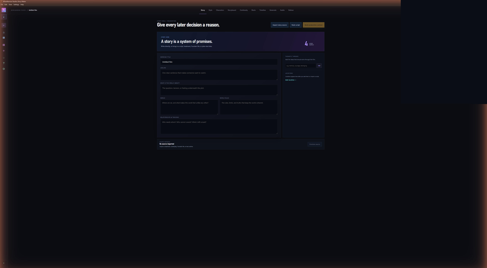
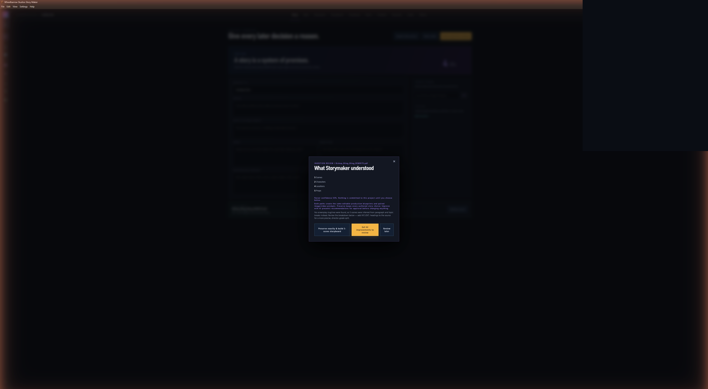
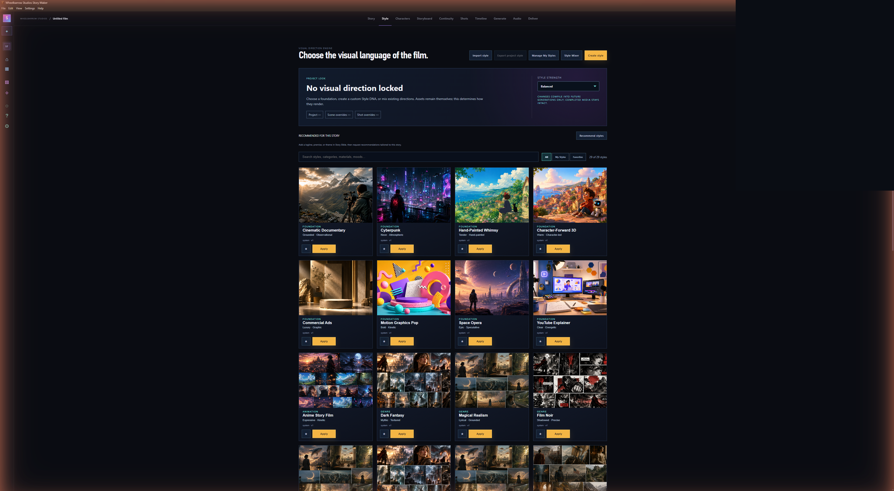
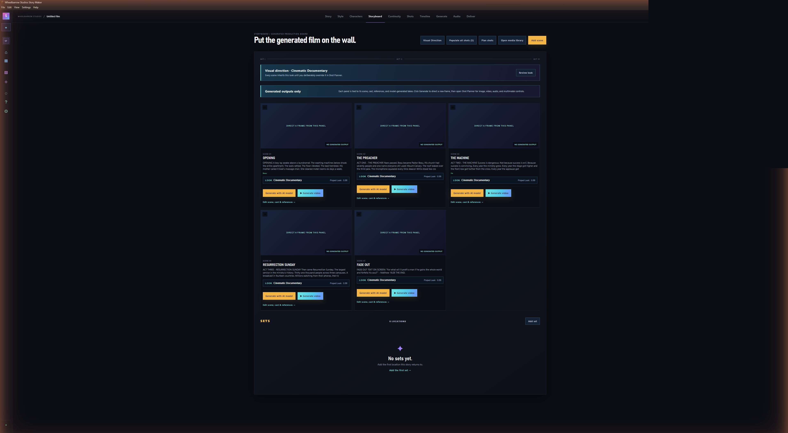
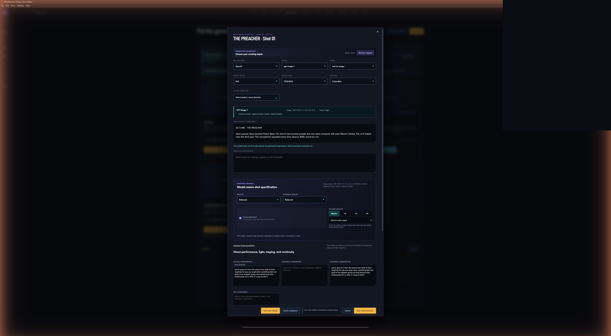

# Storymaker Setup and Field Guide

This guide takes a new user from installation through a saved image-and-video
shot. The same guide is available inside Storymaker from **Help > Story Maker
Guide** or by pressing **F1**.



## 1. Install Storymaker

Storymaker is supplied in two Windows packages:

- **Setup** installs the application and creates normal Windows shortcuts.
- **Portable** runs without installation and can be placed in any writable
  production folder.

Before installing a newer release, save your projects and close every running
Storymaker window. Run the Setup file and follow the Windows prompts. Installing
a new release does not intentionally remove `.storymaker` project files.

For the portable build, place the EXE in a folder where your Windows account can
write files. Do not run it directly from a compressed archive.

### First-launch check

1. Open Storymaker.
2. Close the splash screen.
3. Create a small test project.
4. Save it as a `.storymaker` file.
5. Close and reopen the project before beginning a large production.

## 2. Understand the two workspace modes

**Simple Mode** provides one guided path:

```text
Story → Look → Board → Make → Deliver
```

**Studio Mode** exposes the complete production system, including characters,
sets, props, continuity, per-shot models, camera, lighting, performance, motion,
references, audio, timeline, and delivery controls.

Both modes use the same project data. Switching modes does not create a second
project or remove advanced decisions.



## 3. Connect cloud AI providers

Open **Model Hub** from the left sidebar.

Storymaker supports configured models through:

- OpenAI
- Google Gemini
- fal
- Kie
- WaveSpeed
- OpenRouter

### Connection procedure

1. Create an API key in the provider's official dashboard.
2. Confirm the account has access or credits for the model you intend to use.
3. Find the provider under **Cloud connections** in Model Hub.
4. Paste the key and choose **Save key**.
5. Choose **Check connection**.
6. Do not begin a paid render until the provider reports **Verified**.



Keys are protected with Windows credential encryption. They are not written into
`.storymaker` project files or exported production packages.

Never paste API keys into prompts, project notes, screenshots, or support
messages.

### Provider roles

| Provider | Typical Storymaker use |
| --- | --- |
| OpenAI | Story intelligence and image generation |
| Google Gemini | Story fallback and Nano Banana image models |
| fal | Image, editing, Kling, Seedance, reference and multimodal video |
| Kie | Image/video gateway models such as Kling, Veo, and Seedance |
| WaveSpeed | Image/video gateway models such as Wan and Seedance |
| OpenRouter | Optional language-model routing |

Model capabilities change over time. Storymaker's selected model controls are the
authoritative description of what the installed release will submit.

## 4. Set up local AI

Cloud providers are optional. Storymaker can use Ollama for story intelligence
and ComfyUI for local image and video generation.

### Ollama

1. Install Ollama for Windows from the official Ollama website.
2. Start Ollama.
3. Install a capable instruct model. Storymaker 0.3.64 was verified with
   `qwen3:8b`.
4. Keep Ollama available at `http://127.0.0.1:11434`.
5. Open Storymaker's Model Hub and choose **Refresh local engines**.

When ready, Model Hub lists the installed model and marks Ollama **Ready**.
Storymaker can use it for structured story analysis, recommendations, and AI
Director fallback.

### ComfyUI

1. Install ComfyUI Desktop for Windows.
2. Confirm ComfyUI starts and detects the GPU.
3. Keep ComfyUI Desktop at `http://127.0.0.1:8000`.
4. Portable ComfyUI is also supported at `http://127.0.0.1:8188`.
5. Install the required models into the correct ComfyUI model folders.
6. Restart ComfyUI after adding model files.
7. Open Model Hub and choose **Refresh local engines**.

#### Local FLUX image model

Place:

```text
flux1-schnell-fp8.safetensors
```

in:

```text
ComfyUI/models/checkpoints
```

#### Local Wan video models

The verified Wan 2.1 Fun InP workflow requires:

- Wan 2.1 Fun InP 1.3B diffusion model
- UMT5 XXL text encoder
- Wan 2.1 VAE
- CLIP Vision H

Place each file in its corresponding ComfyUI folder:

```text
ComfyUI/models/diffusion_models
ComfyUI/models/text_encoders
ComfyUI/models/vae
ComfyUI/models/clip_vision
```

Model Hub reports **FLUX Image Ready** and **Wan Video Ready** separately.
ComfyUI merely running does not mean every local capability is installed.

Local video was validated on an NVIDIA RTX 4070 SUPER with 12 GB VRAM. Lower
memory systems may require smaller workflows. Long, high-resolution final videos
will generally be faster through a cloud provider.

## 5. Import and improve a story



Import a supported story, script, treatment, outline, PDF, document, text file,
Fountain/FDX source, image scan, or clipboard text.

Storymaker first shows what it understood. You can:

- preserve the source exactly and build the production structure; or
- request AI improvements and review each proposed change.

Accepting or rejecting one recommendation does not remove the remaining
recommendations. The original imported source remains preserved.



Save the project after accepting changes and after building the storyboard.

## 6. Create production assets

Reusable identities live in three dedicated workspaces in the left navigation:

- **Characters** — people, via **Character Lab**
- **Locations** — recurring places, via **Environment Lab**
- **Props & accessories** — wardrobe, vehicles, creatures, weapons, and any
  other reusable object, via **Asset Lab**

Each workspace works the same way: add an entry, open its Lab to generate or
import a reference image, and approve the result. The approved image becomes
a project asset with its own continuity profile.

To connect an asset to the story, choose **Assign to scenes** on its card (or
assign it from inside a scene's own edit view in Storyboard). Once assigned,
that asset's approved reference is automatically offered to compatible image
and video renders for every shot in that scene — this is how a character's
face, a location's look, or a prop's design stays consistent from shot to
shot without re-attaching it every time.

General references guide appearance and continuity. They do not automatically
become video Start or End Frames.

## 7. Choose or create a Style DNA



Open **Style** to browse the built-in library — genre and mood foundations
(Cyberpunk, Film Noir, Dark Fantasy, and similar) alongside a dedicated set
of 2D animation presets (Sunlit Graphic Storybook, Cut-Paper Theatre,
Ink-and-Wash Legend, and others), filterable with the **2D Animation** chip
above the grid. Choose **Apply** on any preset to make it the project's
visual language — no custom authoring required.

A locked style reaches every generation surface, not just the storyboard:
Character Lab, Environment Lab, and Asset Lab all resolve the current
project (or scene/shot override) Style DNA and fold its material, lighting,
and character/environment/prop-specific language into what they send the
model, so a character generated after locking a style already renders in
that style.

To build your own instead of using a preset, choose **Create style**.

1. Name the style.
2. Describe materials, shapes, palette, lighting, camera, character feeling,
   motion, and anything that must be avoided.
3. Optionally add image references.
4. Assign each reference a role, strength, what to extract, and what to ignore.
5. Save an editable draft, or choose **Interpret with AI**.
6. Review the structured interpretation before accepting it.
7. Generate character, environment, prop, and storyboard previews.
8. Generate a motion preview from an approved style frame.
9. Apply the Style DNA at project, scene, or shot level.

Editing a custom style creates a new version. Earlier versions remain restorable.
Use **Manage My Styles** to rename, duplicate, export, or remove custom styles.
Save a style to **My Styles** to reuse it across projects, or export a
`.storymaker-style` package.

Style DNA controls the rendering language. It does not replace approved
characters, sets, props, or wardrobe identities.

## 8. Generate a storyboard image



1. Open Storyboard.
2. Choose **Generate with AI model** on a scene.
3. Select an image provider and model.
4. Choose aspect ratio and resolution supported by that model.
5. Attach only the production assets needed for the shot.
6. Open Director Controls for camera, lighting, acting, blocking, audio, motion,
   continuity, and negative constraints.
7. Choose **Check readiness**.
8. Generate the image.
9. Review the output and approve the desired take for the storyboard.
10. Save the project.



## 9. Animate the exact storyboard frame

Choose **Animate this exact image** from an approved image, or explicitly select
that image in the shot's Start Frame control.

For image-to-video:

- the Start Frame defines the opening composition;
- the End Frame is optional and only appears for compatible models;
- general references remain separate guidance;
- models with a one-image limit receive only the deliberately selected source
  frame;
- multimodal controls appear only for compatible models.

Run readiness before submitting the job. Completed videos return to Output
History, Media Library, Storyboard, Timeline, and Delivery.

## 10. Save, recover, and deliver

`Ctrl+S` saves the project. Storymaker uses atomic writes and maintains a recovery
copy when replacing an existing project.

Queued generation jobs retain their provider task IDs. On project reopen,
Storymaker checks eligible jobs and can recover completed assets.

Delivery can export:

- a reopenable project;
- staged production assets;
- shot and audio cue lists;
- production notes;
- local visual previews when FFmpeg is available.

## Troubleshooting

### Provider key rejected

Replace the key in Model Hub and run **Check connection**. Confirm it belongs to
the selected provider and has access to the selected model.

### ComfyUI not detected

Confirm ComfyUI is running on port 8000 or 8188. Restart it after installing
models, then refresh local engines.

### Image-to-video requires a Start Frame

Select the approved storyboard image deliberately. General reference images are
not automatically used as start frames.

### Model rejects the reference count

Remove unnecessary references or select a model that supports more images or
multimodal assets.

### Generation completed but output is not visible

Open Output History and choose **Review take**. Check Media Library, save, and
reopen the project so durable-job recovery can run.

### Local video is slow

Use shorter duration and draft resolution, close other GPU applications, or
select a cloud video provider.

### Support information

When reporting a failure, include:

- Storymaker version;
- provider and exact model;
- operation such as text-to-image or image-to-video;
- time of failure;
- displayed error and correlation ID.

Never include the API key.

## Keyboard shortcuts

- `Ctrl+N` — new project
- `Ctrl+O` — open project
- `Ctrl+S` — save project
- `Ctrl+,` — settings
- `F1` — help
